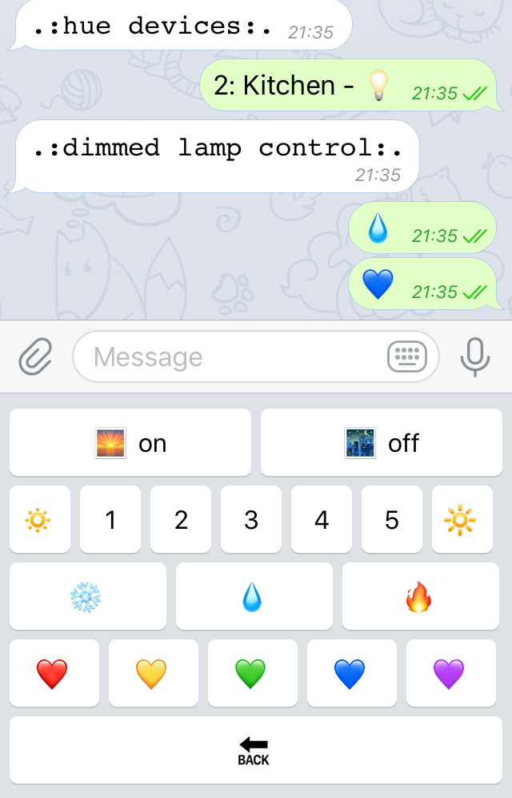

# huemoe
💡 Telegram bot to control your Philips Hue -based smart devices 💡



## Motivation
There are few telegram bots implemented with clojure, even though the development process
is full of joy:
- Controlling your lamp from REPl
- Asking your homemates to play with the bot and the lamp
- Having awesome clojure data structures and libraries for processing the state of the bot and the lights

## Usage

### Prerequisites
- Your Philips Hue system IP address;
- Developer token for your Hue system (can be obtained this way [link](https://developers.meethue.com/documentation/getting-started));
- Telegram API token (you would need to register a bot [link](https://core.telegram.org/bots#6-botfather);
- List of users to allow using this bot (Telegram user unique identifiers (those that start with @ usually));
- `.config.edn` having the same flavour as `example.config.edn` containing the preceding information.

### Try it with REPl

```clojure
(mount/start)
```

### Use your dusty RPi/nettop
```
lein uberjar
rsync target/huemoe-0.1.0-SNAPSHOT-standalone.jar raspi.local
```

### TODO
- Using other devices;
- Automating issuing the hue token (maybe doing an interactive set-up and packing all this into docker for non-developers);
- Reducing the codebase by using the libraries for Hue as well;
- Getting the feedback.

## License

Copyright © 2017 Avdiushkin Vasilii

Distributed under the Eclipse Public License either version 1.0 or (at your option) any later version.
